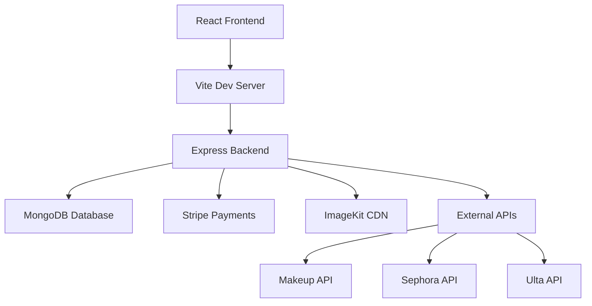

# 🌟 SkinBloom - Premium Skincare E-commerce Platform

<div align="center">


**Revolutionizing skincare shopping with AI-powered dermatologist consultations**

[🚀 Live Demo](#) • [📖 Documentation](#) • [🛠️ API Reference](#api-reference) • [📧 Support](#support)

</div>

---

## ✨ Overview

SkinBloom is a comprehensive, full-stack e-commerce platform that combines premium skincare product shopping with professional dermatologist consultations. Built with modern web technologies, it offers a seamless shopping experience enhanced by expert medical advice and personalized skincare recommendations.

### 🎯 Key Highlights

-   **🛍️ Advanced E-commerce**: Complete shopping cart, wishlist, product comparison, and price tracking
-   **👨‍⚕️ Dermatologist Consultations**: AI-powered skin analysis with professional medical consultations ($50)
-   **🔐 Secure Authentication**: Role-based access (User, Admin, Dermatologist) with JWT tokens
-   **💳 Payment Integration**: Stripe-powered secure payments with receipt generation
-   **📱 Responsive Design**: Mobile-first approach with modern UI/UX
-   **🖼️ Image Management**: ImageKit integration for optimized image delivery
-   **📊 Admin Dashboard**: Comprehensive analytics and product management
-   **🔔 Notification System**: Real-time notifications for orders and consultations

---

## 🏗️ Architecture



### 🛠️ Tech Stack

#### Frontend

-   **React 18** - Modern UI framework with hooks
-   **Vite** - Lightning-fast build tool and dev server
-   **Tailwind CSS** - Utility-first CSS framework
-   **Axios** - HTTP client for API calls
-   **React Router** - Client-side routing
-   **JWT Decode** - Token management
-   **jsPDF** - PDF generation for receipts

#### Backend

-   **Node.js** - Runtime environment
-   **Express.js** - Web application framework
-   **MongoDB** - NoSQL database with Mongoose ODM
-   **JWT** - Authentication and authorization
-   **bcryptjs** - Password hashing
-   **Stripe** - Payment processing
-   **ImageKit** - Image optimization and delivery
-   **PDFKit** - PDF document generation
-   **Multer** - File upload handling

#### External Integrations

-   **Stripe** - Secure payment processing
-   **ImageKit** - Image CDN and optimization
-   **Makeup API** - External product data
-   **Sephora API** - Brand partnerships
-   **Ulta API** - Retail integrations

---

## 🚀 Quick Start

### Prerequisites

-   **Node.js** 18+
-   **MongoDB** 8.0+
-   **npm** or **yarn**
-   **Git**

### Installation

1. **Clone the repository**

    ```bash
    git clone https://github.com/insertfahim/SkinBloom.git
    cd SkinBloom
    ```

2. **Setup Backend**

    ```bash
    cd server
    npm install
    cp .env.example .env  # Configure your environment variables
    npm run dev
    ```

3. **Setup Frontend**

    ```bash
    cd ../client
    npm install
    npm run dev
    ```

4. **Access the application**
    - Frontend: `http://localhost:5173`
    - Backend: `http://localhost:5000`

### Environment Configuration

Create a `.env` file in the server directory:

```env
# Database
MONGODB_URI=mongodb://localhost:27017/skinbloom
JWT_SECRET=your-super-secret-jwt-key
JWT_EXPIRES_IN=7d

# Stripe
STRIPE_SECRET_KEY=sk_test_...
STRIPE_PUBLISHABLE_KEY=pk_test_...

# ImageKit
IMAGEKIT_PUBLIC_KEY=your-imagekit-public-key
IMAGEKIT_PRIVATE_KEY=your-imagekit-private-key
IMAGEKIT_URL_ENDPOINT=https://ik.imagekit.io/your-imagekit-id

# Email (Optional)
EMAIL_USER=your-email@gmail.com
EMAIL_PASS=your-app-password
```

---

## 📋 Features

### 🛍️ E-commerce Features

-   ✅ **Product Catalog**: 94+ premium skincare products
-   ✅ **Advanced Search**: Filter by category, skin type, price, brand
-   ✅ **Shopping Cart**: Persistent cart with quantity management
-   ✅ **Wishlist**: Save products with price alerts
-   ✅ **Product Comparison**: Side-by-side product analysis
-   ✅ **Price Tracking**: Monitor price changes and receive alerts
-   ✅ **Inventory Management**: Real-time stock tracking
-   ✅ **Discount System**: Original vs. sale price display

### 👨‍⚕️ Dermatologist Consultation System

-   ✅ **AI Skin Analysis**: Upload photos for instant analysis
-   ✅ **Professional Consultations**: $50 expert dermatologist advice
-   ✅ **Symptom Tracking**: Detailed symptom logging
-   ✅ **Treatment Plans**: Personalized skincare routines
-   ✅ **PDF Reports**: Downloadable consultation reports
-   ✅ **Payment Integration**: Secure Stripe payments
-   ✅ **Notification System**: Real-time updates on consultation status

### 🔐 Authentication & Security

-   ✅ **Role-Based Access**: User, Admin, Dermatologist roles
-   ✅ **JWT Authentication**: Secure token-based auth
-   ✅ **Password Encryption**: bcrypt hashing
-   ✅ **Session Management**: Persistent login sessions
-   ✅ **Protected Routes**: Role-based route protection

### 📊 Admin Dashboard

-   ✅ **Product Management**: CRUD operations for products
-   ✅ **Category Management**: 40+ product categories
-   ✅ **User Management**: Customer and dermatologist accounts
-   ✅ **Order Analytics**: Sales reports and statistics
-   ✅ **Consultation Oversight**: Monitor dermatologist activities
-   ✅ **System Metrics**: Performance and usage analytics

---

## 📖 API Reference

### Authentication Endpoints

```javascript
POST / api / auth / register;
POST / api / auth / login;
POST / api / auth / logout;
GET / api / auth / profile;
```

### Product Endpoints

```javascript
GET /api/products
GET /api/products/:id
GET /api/products/external
POST /api/products (Admin only)
PUT /api/products/:id (Admin only)
DELETE /api/products/:id (Admin only)
```

### Cart Endpoints

```javascript
GET / api / cart;
POST / api / cart / add;
PUT / api / cart / update;
DELETE / api / cart / remove;
DELETE / api / cart / clear;
```

### Consultation Endpoints

```javascript
POST /api/consultations
GET /api/consultations/:id
PUT /api/consultations/:id/assign (Dermatologist only)
PUT /api/consultations/:id/complete (Dermatologist only)
```

### Payment Endpoints

```javascript
POST /api/payments/create-session
POST /api/payments/webhook
GET /api/payments/receipt/:id
```

---

## 🧪 Testing

### Automated Tests

```bash
# Backend tests
cd server
npm test

# Frontend tests
cd client
npm test
```

### Manual Testing

1. **User Registration & Login**
2. **Product Browsing & Search**
3. **Cart Management**
4. **Wishlist Functionality**
5. **Dermatologist Consultation Flow**
6. **Payment Processing**
7. **Admin Dashboard**

### Test Accounts

-   **Admin**: admin@skinbloom.com / admin123
-   **Dermatologist**: dr.smith@skinbloom.com / derm123
-   **User**: user@skinbloom.com / user123

---

## 📁 Project Structure

```
SkinBloom/
├── client/                     # React Frontend
│   ├── public/
│   ├── src/
│   │   ├── components/         # Reusable UI components
│   │   ├── context/           # React context providers
│   │   ├── ui/                # UI component library
│   │   ├── auth.js            # Authentication utilities
│   │   ├── main.jsx           # App entry point
│   │   └── styles.css         # Global styles
│   ├── package.json
│   └── vite.config.js
├── server/                     # Express Backend
│   ├── controllers/           # Route controllers
│   ├── middleware/            # Custom middleware
│   ├── models/               # MongoDB models
│   ├── routes/               # API routes
│   ├── server.js             # Main server file
│   ├── package.json
│   └── README.md
├── docs/                      # Documentation
├── tests/                     # Test files
└── README.md                  # This file
```

---

## 🚀 Deployment

### Production Build

```bash
# Frontend build
cd client
npm run build

# Backend deployment
cd server
npm run start
```

### Docker Deployment

```dockerfile
# Dockerfile example
FROM node:18-alpine
WORKDIR /app
COPY package*.json ./
RUN npm install --production
COPY . .
EXPOSE 5000
CMD ["npm", "start"]
```

### Environment Variables for Production

```env
NODE_ENV=production
MONGODB_URI=mongodb://production-db:27017/skinbloom
STRIPE_SECRET_KEY=sk_live_...
IMAGEKIT_PUBLIC_KEY=your-prod-public-key
```

---

## 🤝 Contributing

We welcome contributions! Please follow these steps:

1. **Fork the repository**
2. **Create a feature branch**: `git checkout -b feature/amazing-feature`
3. **Commit your changes**: `git commit -m 'Add amazing feature'`
4. **Push to the branch**: `git push origin feature/amazing-feature`
5. **Open a Pull Request**

### Development Guidelines

-   Follow ESLint configuration
-   Write comprehensive tests
-   Update documentation
-   Use conventional commit messages
-   Maintain code coverage above 80%

---

## 📄 License

This project is licensed under the MIT License - see the [LICENSE](LICENSE) file for details.

---

## 👥 Team

-   **Project Lead**: [Your Name]
-   **Frontend Developer**: [Team Member]
-   **Backend Developer**: [Team Member]
-   **UI/UX Designer**: [Team Member]
-   **DevOps Engineer**: [Team Member]

---

## 📞 Support

-   **Email**: support@skinbloom.com
-   **Documentation**: [docs.skinbloom.com](https://docs.skinbloom.com)
-   **Issues**: [GitHub Issues](https://github.com/insertfahim/SkinBloom/issues)
-   **Discussions**: [GitHub Discussions](https://github.com/insertfahim/SkinBloom/discussions)

---

## 🙏 Acknowledgments

-   **React Team** for the amazing frontend framework
-   **Express.js** for the robust backend framework
-   **MongoDB** for the flexible NoSQL database
-   **Stripe** for secure payment processing
-   **ImageKit** for image optimization
-   **Tailwind CSS** for utility-first styling

---

<div align="center">

**Made with ❤️ for healthier, glowing skin**

⭐ Star this repo if you found it helpful!

[⬆️ Back to Top](#skinbloom---premium-skincare-e-commerce-platform)

</div></content>
<parameter name="filePath">c:\Users\Shuvo\Desktop\SkinBloom\README.md
